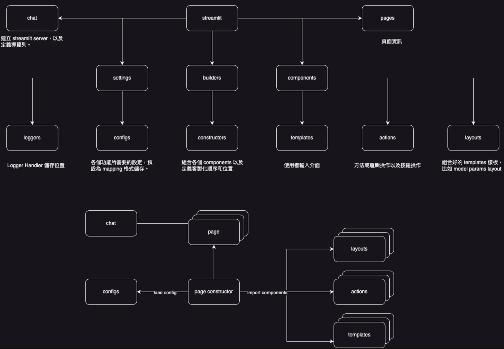
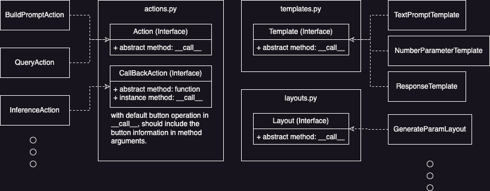

# Lab

This is a repository for setting up the demosite using streamlit including prompt lab and any gen project.   
> You should have a basic knowledge with python and streamlit before developping via this repository, please refer to [streamlit docs](https://docs.streamlit.io/) for prerequisite knowledge.

## Usage

+ Clone the project: 
```bash
$ git clone https://github.com/Weber12321/llm-sd.git
```

+ Change directory into the repository and setting up the required environment settings, run the command below:
> Replace the `LLM_URI` and `API_URI` with your host and port in `docker-var.env`. 
```bash
$ cp docker-vars.env.example docker-var.env
$ cp .env.example .env
$ cp docker-compose.yml.example docker-compose.yml
```

+ Start up the demosite service:
```bash
$ docker compose up
```

## Structuredetails.



To develop a new page, setup the new constructor in `apps/builders/constructors.py` with new page in `apps/page/{your_page}.py`, do not forget to add the page into the navigation bar in `apps/start.py`.

> If you added any third-party packages in requirement, please rebuild the docker image and push it to the organization's dockerhub.